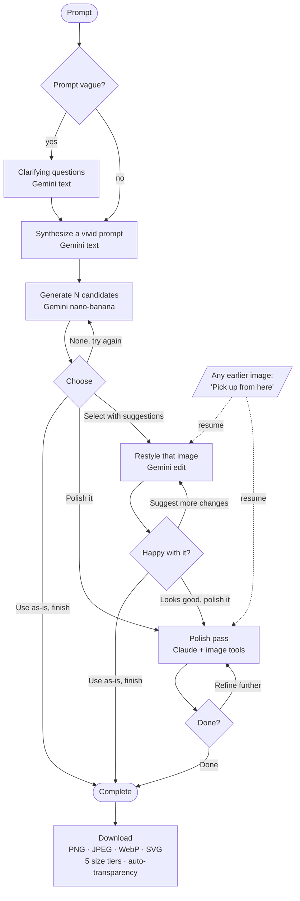
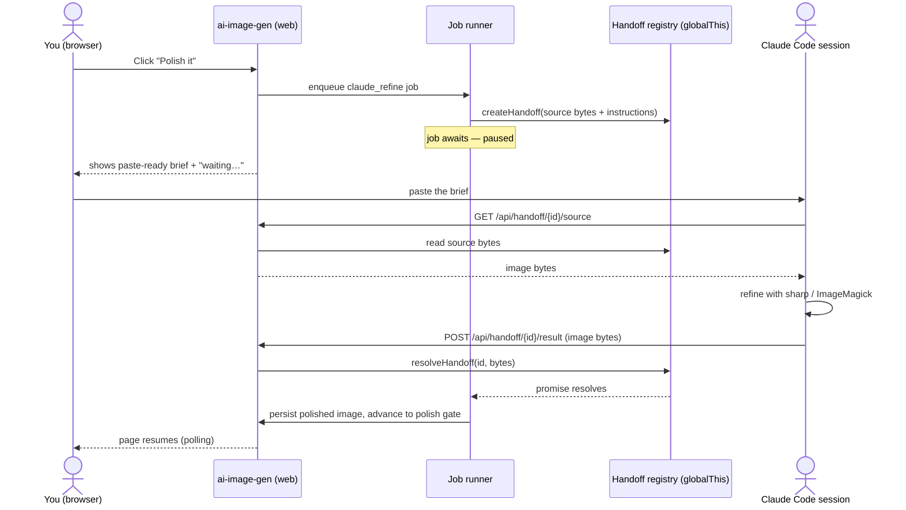

# ai-image-gen

A two-engine AI image generation & refinement studio.

You describe what you want; the app turns it into a finished graphic through two complementary AI engines:

- **Google Gemini "nano-banana"** (`gemini-3.1-flash-image`) owns the **creative phase** — sharpening your prompt with clarifying questions, generating candidates, and conversational style edits ("more cinematic", "warmer palette", "add a cape").
- **Claude (Agent SDK)** owns the **technical phase** — sharpness, color, clean lines/shapes, scaling, layering, background transparency, format conversion, and fixing AI-generation artifacts (odd color transitions, stray white gaps, banding). Claude inspects the image and drives deterministic image tools (`sharp` / ImageMagick today, GIMP CLI later).

Everything is organized into **image projects**: every image at every step is saved with its lineage, so you can browse the whole journey, step back to any earlier image, and finish whenever you like.

## The creative → technical flow

The journey loops within each engine and only crosses to Claude once you're happy with a pick. You can also finish without polishing at any selection step.



- **Gemini loop** (`gemini_refining`): restyle one image with natural-language suggestions, as many rounds as you want.
- **Claude loop** (`claude_refining`): an automatic clean-up pass runs on entry, then refine further with your own instructions or finish.
- **Pick up from here**: any image in the history can resume the project from that point (re-enters the matching loop) — for when a later path went the wrong way.
- **Prompt history**: the original prompt, the AI-synthesized prompt (marked with a ✦), and each step's instruction are logged on the project page. The system clean-up brief is sent to Claude but never shown.

## Architecture

- **State machine** — `clarifying → generating → choosing → (gemini_refining)* → (claude_refining)* → complete`. User/API actions live in `src/logic/projectService.ts`; engine-result transitions live in `src/logic/jobProcessor.ts`.
- **Async jobs** — every AI call is a `Job` row drained by an in-process runner (`jobProcessor`, started from `src/instrumentation.ts`). The UI polls until a job finishes, so long generations never hit a request timeout.
- **Engines behind interfaces** — `ImageGenerator` (Gemini) and `ImageRefiner` (Claude) are DI'd via tsyringe (`src/container.ts`) and resolved per-engine by env, so modes are easy to mix and mock.
- **Storage & tagging** — image bytes in S3 (MinIO locally), metadata in Postgres. Each image is tagged at generation with `shapeAvailable` / `transparentBgAvailable` (heuristics in `imageAnalysis.ts`) which drive the download options. Images stream through `/api/images/[id]`.

### Provider modes

`AI_PROVIDER` is the default for both engines; `GEMINI_PROVIDER` / `CLAUDE_PROVIDER` override per engine.

| Mode | Gemini | Claude | Cost | Use |
|------|--------|--------|------|-----|
| `fixtures` | canned questions + placeholder images | `sharp` stand-in pass | none | offline UI/flow dev |
| `live` | real nano-banana + text | real Claude Agent SDK | API tokens | production / real output |
| `handoff` | — | pause and let a local Claude Code session do the polish | none | dev polish without an Anthropic key |

### Downloads

The finished image exports as **PNG, JPEG, WebP** (always) and **SVG** (only when the image tags as a vectorizable shape — color-traced via `imagetracerjs`). Five size tiers (longest edge): X-Small 32 · Small 128 · Medium 512 · Large 2048 · X-Large 4096. PNG is auto-made-transparent when the image tags as having a white/black background.

## Working with Claude Code locally (handoff mode)

`CLAUDE_PROVIDER=handoff` relays the polish step to *your* Claude Code session instead of calling the Anthropic API — no key, no token cost, and ToS-clean (you do the work; the app doesn't use subscription auth programmatically). The polish job pauses and exposes a paste-ready brief; any Claude Code session can fetch the image, refine it, and post the result back, at which point the project resumes.



Endpoints: `GET /api/handoff` (list pending tasks + briefs), `GET /api/handoff/[id]/source` (download the image to work on), `POST /api/handoff/[id]/result` (post the refined bytes — raw body with an image `Content-Type`, or JSON `{ imageBase64, mimeType }`).

> The registry is in-memory (on `globalThis`, so it survives HMR module reloads and is shared across the runner and route handlers). A full dev-server **restart** still strands an in-flight handoff. Run the worker session inside this project so `sharp` is available, and access the app on the same host the brief is generated from.

## Stack

Next.js 16 (App Router) · React 19 · TypeScript · Tailwind v4 (Volare brand) · Prisma 7 / PostgreSQL · tsyringe ·
`@google/genai` · `@anthropic-ai/claude-agent-sdk` · `sharp` · `imagetracerjs` · AWS S3 · Docker.

## Local development

Requires Docker. Postgres + MinIO + the web app run via compose.

```bash
cp .env.example .env          # defaults to AI_PROVIDER=fixtures — no API keys needed
docker compose up --build
```

- App: http://localhost:3000 (the dev server falls back to 3001 if 3000 is taken)
- MinIO console: http://localhost:9001 (minioadmin / minioadmin)

Run the app on the host against just the data services (faster iteration):

```bash
docker compose up -d db minio createbucket
npm install
npm run db:migrate:dev        # create the schema
npm run dev
```

Handy env knobs (see `.env.example`): `CANDIDATE_COUNT` (options per round), `CLARIFY_MAX_QUESTIONS`, `DB_PORT` (host port if 5432 is in use), the model overrides, and the per-engine provider modes above.

Useful scripts: `npm run build`, `npm run lint`, `npm test`, `npm run db:studio`.

## Deploying to AWS (App Runner + RDS + S3)

App Runner runs a **single container image**; Postgres is **RDS** (not in App Runner) and images live in **S3**.

1. **Provision**
   - An **S3 bucket** for images (e.g. `ai-image-gen-prod`).
   - An **RDS PostgreSQL** instance; note its connection string for `DATABASE_URL`/`DIRECT_URL`.
   - An **ECR repository** for the image.

2. **Build & push the image**

   ```bash
   AWS_REGION=us-east-1 ACCOUNT=<your-account-id>
   aws ecr get-login-password --region $AWS_REGION \
     | docker login --username AWS --password-stdin $ACCOUNT.dkr.ecr.$AWS_REGION.amazonaws.com
   docker build -t ai-image-gen .
   docker tag ai-image-gen $ACCOUNT.dkr.ecr.$AWS_REGION.amazonaws.com/ai-image-gen:latest
   docker push $ACCOUNT.dkr.ecr.$AWS_REGION.amazonaws.com/ai-image-gen:latest
   ```

3. **Create the App Runner service** from that ECR image:
   - Port `3000`, health check path `/api/health`.
   - **Min = Max = 1 instance** for the MVP — the in-process job runner, the in-memory handoff registry, and the Claude scratch dir assume a single instance.
   - **Instance role**: attach an IAM role with `s3:PutObject`/`s3:GetObject` on the bucket; then leave `S3_ACCESS_KEY_ID`/`S3_SECRET_ACCESS_KEY` **unset** (the SDK uses the role).
   - **Environment** (use App Runner secrets for the keys):
     - `AI_PROVIDER=live` (handoff is a local-dev mode; don't use it in prod)
     - `DATABASE_URL`, `DIRECT_URL` → RDS
     - `ANTHROPIC_API_KEY`, `GEMINI_API_KEY`
     - `S3_BUCKET`, `S3_REGION` (leave `S3_ENDPOINT` / `S3_FORCE_PATH_STYLE` unset for real S3)
     - optional: `GEMINI_IMAGE_MODEL`, `GEMINI_TEXT_MODEL`, `CLAUDE_MODEL`, `CANDIDATE_COUNT`

   The container runs `prisma migrate deploy` on start, then `next start`.

## License

MIT © Volare Consulting
